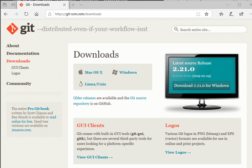
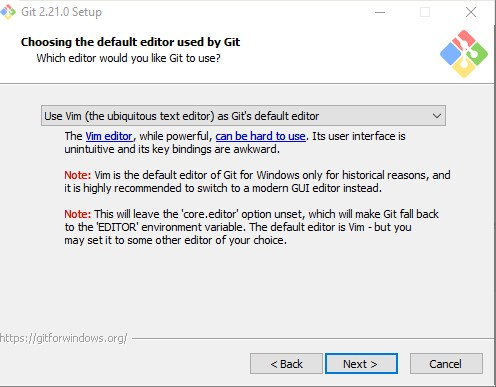
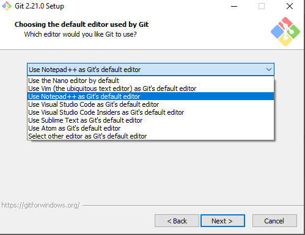

# Lab for Module 1 - Git Overview
# Installing Git and command line basics
Hands on Lab

## Conditions and Terms of Use Microsoft Confidential - For Internal Use Only

This training package is proprietary and confidential, and is intended only for uses described in the training materials. Content and software is provided to you under a Non-Disclosure Agreement and cannot be distributed. Copying or disclosing all or any portion of the content and/or software included in such packages is strictly prohibited.

The contents of this package are for informational and training purposes only and are provided "as is" without warranty of any kind, whether express or implied, including but not limited to the implied warranties of merchantability, fitness for a particular purpose, and non-infringement.

Training package content, including URLs and other Internet Web site references, is subject to change without notice. Because Microsoft must respond to changing market conditions, the content should not be interpreted to be a commitment on the part of Microsoft, and Microsoft cannot guarantee the accuracy of any information presented after the date of publication. Unless otherwise noted, the companies, organizations, products, domain names, e-mail addresses, logos, people, places, and events depicted herein are fictitious, and no association with any real company, organization, product, domain name, e-mail address, logo, person, place, or event is intended or should be inferred.

**Copyright and Trademarks**

Microsoft may have patents, patent applications, trademarks, copyrights, or other intellectual property rights covering subject matter in this document. Except as expressly provided in written license agreement from Microsoft, the furnishing of this document does not give you any license to these patents, trademarks, copyrights, or other intellectual property.

Complying with all applicable copyright laws is the responsibility of the user. Without limiting the rights under copyright, no part of this document may be reproduced, stored in or introduced into a retrieval system, or transmitted in any form or by any means (electronic, mechanical, photocopying, recording, or otherwise), or for any purpose, without the express written permission of Microsoft Corporation.

For more information, see Use of Microsoft Copyrighted Content at _[htt](http://www.microsoft.com/about/legal/permissions/)[p](http://www.microsoft.com/about/legal/permissions/)_[://www.microsoft.com/about/legal/permissions/](http://www.microsoft.com/about/legal/permissions/)

Microsoft®, Internet Explorer®, and Windows® are either registered trademarks or trademarks of Microsoft Corporation in the United States and/or other countries. Other Microsoft products mentioned herein may be either registered trademarks or trademarks of Microsoft Corporation in the United States and/or other countries. All other trademarks are property of their respective owners.

© 2019 Microsoft Corporation.  All rights reserved.

## Exercise 1: Installing Git and Initializing a Repo

1. Download Git from https://git-scm.com/downloads

2. Run the downloaded package

3. Choose the defaults options, except for the default editor choice.

Unless you are familiar and comfortable with Vim, choose another editor option.  Choose one that you are comfortable with (your choices may vary from the list show here).

4. For the remaining options go with the defaults.

## Exercise 2: Staging and Committing a change

1. Open command prompt

2. Create a new folder and go into the folder

3. Type **git status** and press enter to run the command

Since there is no repo, you should see the following message

  > fatal: not a git repository (or any of the parent directories): .git

4. Run **git init**

After running init you should see this message  

>Initialized empty Git repository in C:/your-folder/your-repo/.git/

5. Run **git status**

You should now see the following message
> On branch master

> No commits yet

> nothing to commit (create/copy files and use "git add" to track)

6. Run **echo first line>newcode.cs** in order to create a new file

> You will not get a response on the command line

7. Run **git status**

You should now see the following message

> On branch master

> No commits yet

> Untracked files:

>    Use "git add file..." to include what will be committed
>      newcode.cs

> nothing added to commit but untracked files present (use "git add" to track)
8. Run **git add newcode.cs**

9. Run **git status**

You should now see the following message
> On branch master

> No commits yet

> Changes to be committed: 
>    Use "git rm --cached file..." to unstage

>   new file:     newcode.cs

10. Run **git commit newcode.cs -m"Inital commit"**

You should now see the following message
> [master (root-commit) 6f6abc7] Inital commit  
> 1 file changed, 1 insertion(+) 
> create mode 100644 newcode.cs

11. Run **git status**

You should now see the following message

> On branch master

> No commits yet, working tree clean

## Exercise 3: Commit a change without staging it

1. Run **git status**

2. Run **echo second line>>newcode.cs** in order to create a new file

3. Run **git status**

> On branch master

> Changes not staged for commit:

> Changes not staged for commit: 
>    (use "git add <file>..." to update what will be committed) 
>    (use "git checkout -- <file>..." to discard changes in working directory)

> modified:   newcode.cs

> no changes added to commit (use "git add" and/or "git commit -a")

4. Run **git commit -am"New code added"**

You should now see the following message
> [master 23fa51c] New code added  
> 1 file changed, 1 insertion(+) 

5. Run **git status**

You should now see the following message

> On branch master

> No commits yet, working tree clean

In this lab you used **git status** to inspect the repository. You also used **git init** to create a new local respository. And you used **git add** and **git commit**. In forthcoming labs you will often reuse these commands.

