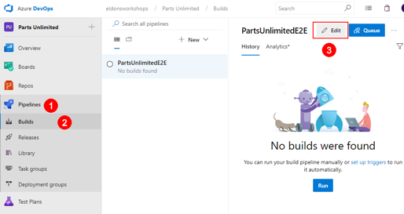
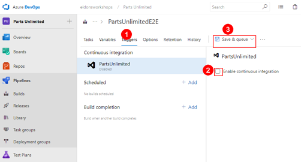
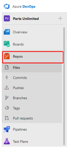
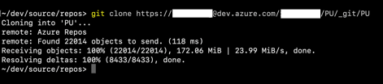
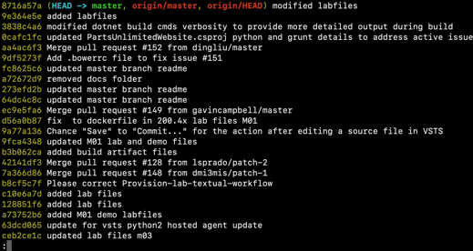

# Lab for Module 3 Local and Remote Repositories
# Cloning an Existing Repository
Hands on Lab

## Conditions and Terms of Use Microsoft Confidential - For Internal Use Only

This training package is proprietary and confidential, and is intended only for uses described in the training materials. Content and software is provided to you under a Non-Disclosure Agreement and cannot be distributed. Copying or disclosing all or any portion of the content and/or software included in such packages is strictly prohibited.

The contents of this package are for informational and training purposes only and are provided "as is" without warranty of any kind, whether express or implied, including but not limited to the implied warranties of merchantability, fitness for a particular purpose, and non-infringement.

Training package content, including URLs and other Internet Web site references, is subject to change without notice. Because Microsoft must respond to changing market conditions, the content should not be interpreted to be a commitment on the part of Microsoft, and Microsoft cannot guarantee the accuracy of any information presented after the date of publication. Unless otherwise noted, the companies, organizations, products, domain names, e-mail addresses, logos, people, places, and events depicted herein are fictitious, and no association with any real company, organization, product, domain name, e-mail address, logo, person, place, or event is intended or should be inferred.

**Copyright and Trademarks**

Microsoft may have patents, patent applications, trademarks, copyrights, or other intellectual property rights covering subject matter in this document. Except as expressly provided in written license agreement from Microsoft, the furnishing of this document does not give you any license to these patents, trademarks, copyrights, or other intellectual property.

Complying with all applicable copyright laws is the responsibility of the user. Without limiting the rights under copyright, no part of this document may be reproduced, stored in or introduced into a retrieval system, or transmitted in any form or by any means (electronic, mechanical, photocopying, recording, or otherwise), or for any purpose, without the express written permission of Microsoft Corporation.

For more information, see Use of Microsoft Copyrighted Content at [www.microsoft.com/about/legal/permissions/](http://www.microsoft.com/about/legal/permissions/)

Microsoft®, Internet Explorer®, and Windows® are either registered trademarks or trademarks of Microsoft Corporation in the United States and/or other countries. Other Microsoft products mentioned herein may be either registered trademarks or trademarks of Microsoft Corporation in the United States and/or other countries. All other trademarks are property of their respective owners.

© 2019 Microsoft Corporation.  All rights reserved.

# Overview

Azure DevOps supports two types of version control, Git and Team Foundation Version Control (TFVC). Here is a quick overview of the two version control systems:

**Git**: Git is a distributed version control system. Git repositories can live locally (such as on a developer’s machine). Each developer has a copy of the source repository on their dev machine. Developers can commit each set of changes on their dev machine and perform version control operations such as history and compare without a network connection.

**Team Foundation Version Control (TFVC)**: TFVC is a centralized version control system. Typically, team members have only one version of each file on their dev machines. Historical data is maintained only on the server. Branches are path-based and created on the server.

Git is the default version control provider for new projects. You should use Git for version control in your projects unless you have a specific need for centralized version control features in TFVC.

In this lab, you will learn how to establish a local Git repository, which can easily be synchronized with a centralized Git repository in Azure DevOps. In addition, you will learn about Git branching and merging support.

**Prerequisites**
 1. Git for Windows or Git for your operating system
 2. Azure DevOps account - See "WorkshopPlus Azure DevOps Essentials - Git Lab Setup Instructions" markdown file 

## Exercise 1: Cloning an existing repository
### Task 1:  Setting up team project from the Demo Generator
If you have not yet run the Demo Generator see the "WorkshopPlus Azure DevOps Essentials - Git Lab Setup Instructions" markdown file and follow the instructions.
 
### Task 2: Configuring the Parts Unlimited project

 1. Navigate to your team project on Azure DevOps such as, https://dev.azure.com/YOURACCOUNT/Parts%20Unlimited.
 2. We will want to disable continuous integration trigger before digging into Git.
 3. Navigate to **(1)Pipelines | (2)Builds | (3)Edit**

 

 4. This build is scheduled to run whenever a change is committed. We don’t want to wait for this build every time there’s a change, so select the **(1)Triggers** tab and uncheck **(2)Enable continuous integration**. From the **(3)Save & queue** dropdown, select **Save**.

 

### Task 3: Clone a repository

1. Navigate to the **Repos** hub

2. Click **(1)Clone** and then the **(2)copy icon**.

3. Open a terminal or command prompt on your local computer.
4. Change directory to a location where you want to clone the repository. The default location will be something like /users/username/source/repos.
5. Once you have changed to the directory where you want to clone the repository from Azure DevOps type the following command: **git clone https://YOURACCOUNT@dev.azure.com/YOURACCOUNT/PartsUnlimited/_git/PartsUnlimited**.
You should see output that resembles the following:

6. Change to the newly created respository - **cd PU**. In the above image it would be PU but yours may be PartsUnlimited.
7. Run the command **git status** to inspect the respository.
8. You should see the following output:

>On branch master

>Your branch is up to date with 'origin/master'.

>nothing to commit, working tree clean 

### Task 3: Configuring your respository  
1. At the prompt run **git config user.email​** and you should see the following response:
>git config user.email

>youremailalias@yourdomain.com

If you don't have an email address returned the run **git config user.email youremail@yourdomain.com**. You will not see any output. Run **git config user.email​** to verify the change.

2. To see all global configurations run **git config --global -l**
3. To see all local configurations run **git config --local -l**. Note that you should see a configuration for remote.origin.url=https://YOURACCOUNT@dev.azure.com/YOURACCOUNT/PartsUnlimited/_git/PartsUnlimited**. This configuration was set by the **git clone** command.

### Task 4: Viewing your local repository history
1. At the command prompt run **git log --oneline**. Your output should look like the following:

 

2. Press the **Enter** key to advance a line, press the **space bar** to advance multiple lines, and **Q** to quit. 
 
## Congratulations, you have cloned and configured a respository, viewed its history and you are now ready to start making commits,  branches, etc!