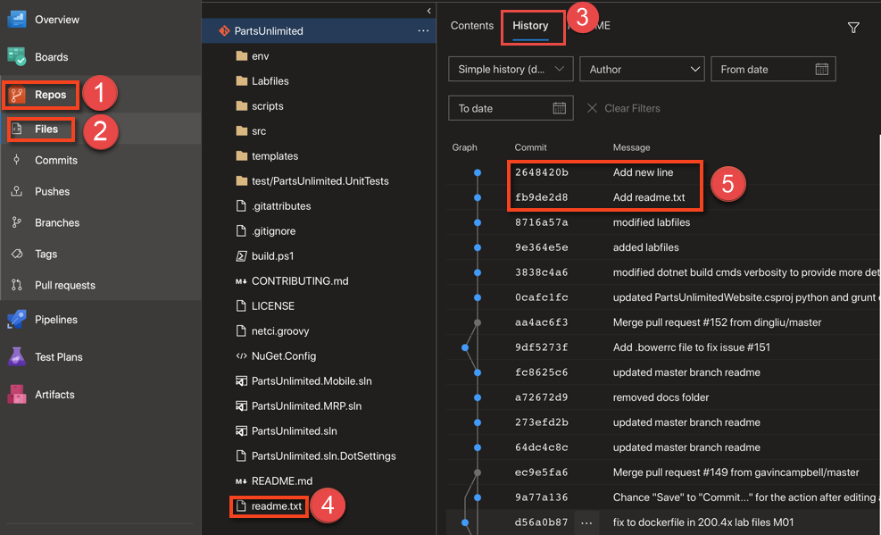

# Lab for Module 4 Using Git
# Making changes, committing your work, and sharing your work
Hands on Lab

## Conditions and Terms of Use Microsoft Confidential - For Internal Use Only

This training package is proprietary and confidential, and is intended only for uses described in the training materials. Content and software is provided to you under a Non-Disclosure Agreement and cannot be distributed. Copying or disclosing all or any portion of the content and/or software included in such packages is strictly prohibited.

The contents of this package are for informational and training purposes only and are provided "as is" without warranty of any kind, whether express or implied, including but not limited to the implied warranties of merchantability, fitness for a particular purpose, and non-infringement.

Training package content, including URLs and other Internet Web site references, is subject to change without notice. Because Microsoft must respond to changing market conditions, the content should not be interpreted to be a commitment on the part of Microsoft, and Microsoft cannot guarantee the accuracy of any information presented after the date of publication. Unless otherwise noted, the companies, organizations, products, domain names, e-mail addresses, logos, people, places, and events depicted herein are fictitious, and no association with any real company, organization, product, domain name, e-mail address, logo, person, place, or event is intended or should be inferred.

**Copyright and Trademarks**

Microsoft may have patents, patent applications, trademarks, copyrights, or other intellectual property rights covering subject matter in this document. Except as expressly provided in written license agreement from Microsoft, the furnishing of this document does not give you any license to these patents, trademarks, copyrights, or other intellectual property.

Complying with all applicable copyright laws is the responsibility of the user. Without limiting the rights under copyright, no part of this document may be reproduced, stored in or introduced into a retrieval system, or transmitted in any form or by any means (electronic, mechanical, photocopying, recording, or otherwise), or for any purpose, without the express written permission of Microsoft Corporation.

For more information, see Use of Microsoft Copyrighted Content at _[htt](http://www.microsoft.com/about/legal/permissions/)[p](http://www.microsoft.com/about/legal/permissions/)_[://www.microsoft.com/about/legal/permissions/](http://www.microsoft.com/about/legal/permissions/)

Microsoft®, Internet Explorer®, and Windows® are either registered trademarks or trademarks of Microsoft Corporation in the United States and/or other countries. Other Microsoft products mentioned herein may be either registered trademarks or trademarks of Microsoft Corporation in the United States and/or other countries. All other trademarks are property of their respective owners.

© 2019git st Microsoft Corporation.  All rights reserved.

#Overview

In this lab you will continue with the repository you created in the previous labs. You will work with your local respository, add a file, modify a file, commit your changes. And share with others. 

**Prerequisites**
 1. Module 1 Lab Git Overview
 2. Module 3 Lab Repos Local and Remote

## Exercise 1: Saving work with commits and adding a new file.
When you make changes to your files, Git will record the changes in the local repository. You can select the changes that you want to commit by staging the changes. Commits are always made against your local Git repository, so you don’t have to worry about the commit being perfect or ready to share with others. You can make more commits as you continue to work and push the changes to others when they are ready to be shared.

What’s in a commit?

Git commits consists of the following:
* The file(s) changed in the commit. Git keeps the contents of all file changes in your repo in the commits. This keeps it fast and allows intelligent merging.
* A reference to the parent commit(s). Git manages your code history using these references.
* A message describing a commit. You give this message to Git when you create the commit. It’s a good idea to keep this message descriptive, but to the point.

### Task 1: Work in your repository and inspect it.
1. Open a shell such as Cmd or Terminal.
2. Change directory to your local repository for PartsUnlimited.
3. Run **git status** to verify that you are on the master branch and see the following output:

>On branch master

>Your branch is up to date with 'origin/master'.

>nothing to commit, working tree clean 

### Task 2: Create a new text file and add it to the repository.
1. Create a new text file and add text such as **Hello World!**. Use a text editor or this at the prompt **echo "Hello World!" > readme.txt**
2. Run **git status** with the following output:

>On branch master
>Your branch is up to date with 'origin/master'.
>
>Untracked files:
>  (use "git add file..." to include in what will be committed)
>
>	readme.txt
>
>nothing added to commit but untracked files present (use "git add" to track)

3. Run **git add readme.txt** to stage the new file.
4. Run **git status** and you should now see the following message

>On branch master
>Your branch is up to date with 'origin/master'.
>
>Changes to be committed:
>  (use "git reset HEAD <file>..." to unstage)
>
>	new file:   readme.txt

5. Now you will commit this new file to the repository with a message.
6. Run **git commit readme.txt -m"Add readme.txt"** and you should now see the following message

> [master (root-commit) 6f6abc7] Inital commit  
> 1 file changed, 1 insertion(+) 
> create mode 100644 readme.txt

7. run **git status**

You should now see the following message

> On branch master

> No commits yet, working tree clean

## Exercise 2: Modify a file and commit the change without staging it
### Task 1: Modify a file and add it to the repository.
1. Run **git status** to verify the current state of the repository.
2. Edit readme.txt and add a new line such as **Hello Workshop!**. Use a text editor or this at the prompt **echo "Hello Workshop!" >> readme.txt**
3. Run **git commit -am"Add new line"** and you should now see the following message

> [master 23fa51c] New code added  
> 1 file changed, 1 insertion(+) 

5. run **git status**

You should now see the following message

> On branch master

> No commits yet, working tree clean

## Exercise 3: Push your changes to the remote server to share with others.
### Task 1: Fetch any changes and push your changes.
1. As a best practice, before pushing your changes you will want to see if there are any changes on the remote server that you don't have. 
2. Run **git fetch** to view any changes that your team. 
    Fetching changes does not merge the commits into your local repository, it just enumerates them. If there were any changes, you would need to pull them in to merge them with your local repository.

3. Since there are no changes, run **git pull** anyway to go through the process.
4. Run **git push** to share your changes. There are many options with the push command such as specifying the remote server by name if you have several. The default is **origin**.
5. Your changes are now push to the remote server.

### Task 2: View the changes you pushed to Azure DevOps.
1. To see your changes on the server point your browser to **https://dev.azure.com/YOURACCOUNT/PartsUnlimited**.
1. Select **(1)Repos Hub**, select **(2)Files**, select **History**
1. You will see the **(4)** new file added and the **(5)**two commits you made with your message.

## Congratulations, you have added and modified a file in your local repository, shared your changes with your team, and viewed the changes on Azure DevOps!