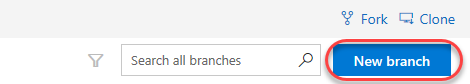
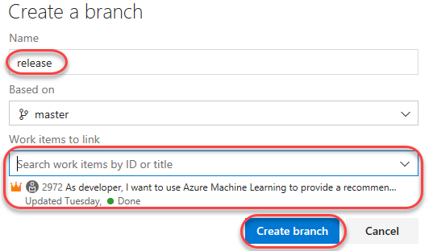
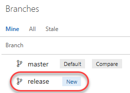
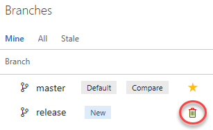
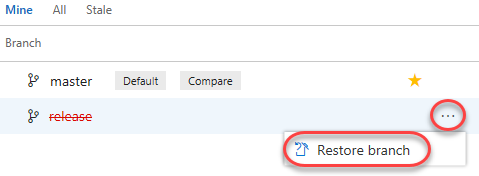
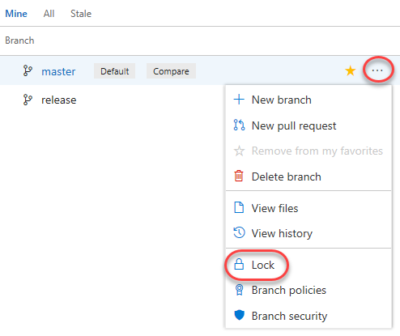
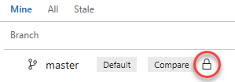
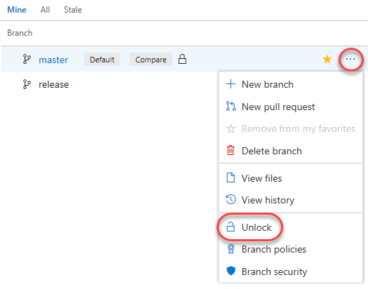

# Lab for Module 5 Branching and Merging
# Create a new branch, switch branches, make edits, and merge changes
Hands on Lab

## Conditions and Terms of Use Microsoft Confidential - For Internal Use Only

This training package is proprietary and confidential, and is intended only for uses described in the training materials. Content and software is provided to you under a Non-Disclosure Agreement and cannot be distributed. Copying or disclosing all or any portion of the content and/or software included in such packages is strictly prohibited.

The contents of this package are for informational and training purposes only and are provided "as is" without warranty of any kind, whether express or implied, including but not limited to the implied warranties of merchantability, fitness for a particular purpose, and non-infringement.

Training package content, including URLs and other Internet Web site references, is subject to change without notice. Because Microsoft must respond to changing market conditions, the content should not be interpreted to be a commitment on the part of Microsoft, and Microsoft cannot guarantee the accuracy of any information presented after the date of publication. Unless otherwise noted, the companies, organizations, products, domain names, e-mail addresses, logos, people, places, and events depicted herein are fictitious, and no association with any real company, organization, product, domain name, e-mail address, logo, person, place, or event is intended or should be inferred.

**Copyright and Trademarks**

Microsoft may have patents, patent applications, trademarks, copyrights, or other intellectual property rights covering subject matter in this document. Except as expressly provided in written license agreement from Microsoft, the furnishing of this document does not give you any license to these patents, trademarks, copyrights, or other intellectual property.

Complying with all applicable copyright laws is the responsibility of the user. Without limiting the rights under copyright, no part of this document may be reproduced, stored in or introduced into a retrieval system, or transmitted in any form or by any means (electronic, mechanical, photocopying, recording, or otherwise), or for any purpose, without the express written permission of Microsoft Corporation.

For more information, see Use of Microsoft Copyrighted Content at _[htt](http://www.microsoft.com/about/legal/permissions/)[p](http://www.microsoft.com/about/legal/permissions/)_[://www.microsoft.com/about/legal/permissions/](http://www.microsoft.com/about/legal/permissions/)

Microsoft®, Internet Explorer®, and Windows® are either registered trademarks or trademarks of Microsoft Corporation in the United States and/or other countries. Other Microsoft products mentioned herein may be either registered trademarks or trademarks of Microsoft Corporation in the United States and/or other countries. All other trademarks are property of their respective owners.

© 2019 Microsoft Corporation.  All rights reserved.

# Overview
In this lab you will continue with the repositories you created in the previous labs. 

You can manage the work in your remote Git repo from the **Branches** view on the web. You can also customize the view to track the branches you care most about so you can stay on top of changes made by your team.

Committing changes to a branch will not affect other branches, and you can share branches with others without having to merge the changes into the master branch. You can also create new branches to isolate changes for a feature or a bug fix from your master branch and other work. Since the branches are lightweight, switching between branches is quick and easy. Git does not create multiple copies of your source when working with branches, but rather uses the history information stored in commits to recreate the files from a snapshot on a branch when you start working on it. Your Git workflow should create and use branches for managing features and bugfixes. The rest of the Git workflow, such as sharing code and reviewing code with pull requests, all work through branches. Isolating work in branches makes it very simple to change what you are working on by simply changing your current branch.

**Prerequisites**
 1. Module 4 Using Git

##  Exercise 1: Working with Branches
### Task 1: Creating a new branch in your local repository
1. Open a shell such as Cmd or Terminal.
2. Change directory to your local repository for PartsUnlimited.
3. Run **git status** to verify that you are on the master branch and see the following output:

>On branch master

>Your branch is up to date with 'origin/master'.

>nothing to commit, working tree clean 

4. There is only one local branch at this time, which is **master**. 
5. Run **git branch** and you should only see **master**.
6. Run **git branch -a** to see a list of branches on the remote server. 
7. Run **git branch dev** to create a new branch.
8. Run **git branch** and you should see:

>dev

> \* master

The asterisk means the current branch is **master**. 

9. Run **git checkout dev** to switch to the new **dev** branch and you will see the following message:

>Switched to branch 'dev'

### Task 2: Make changes in the new branch and commit them.
1. Edit readme.txt and add a new line such as **Hello from the dev branch!**. Use a text editor or type this at the prompt **echo "Hello from the dev branch!" >> readme.txt**
2. Run **git commit -am"Add new line from dev branch"** to commit your changes.
### Task 3: Share your changes and branch with your team.
1. Run **git push origin dev** to share your branch with your team. *Origin is needed if the remote is not configured for the current branch.*

2. View your branch on Azure DevOps by switching to the **Branches** tab.
 
 

3. If all you see is the master branch you may have to click on **All** to see the newly pushed **dev** branch.

### Task 3: Merging your local branch and deleting branches locally and remotely.
1. You are now going to delete the local branch.
2. Run **git checkout master** to switch back to the master branch and you should see the following output:

>Switched to branch 'master'
>
>Your branch is up to date with 'origin/master'.

3. Currently your **master** branch is not up to date with the change you made in **dev**. In a team workflow you would not merge changes back into your local master. You would merge the **origin/dev** into **origin/master** and the pull the changes into your local master. However, to demonstrate merge we are going to merge your local dev branch into your master branch.
4. Run **git merge dev** and see the following output:

>Updating 2648420b..a88d749c
>
>Fast-forward
> readme.txt | 1 +
> 1 file changed, 1 insertion(+)

4. You have now merged your changes into **master from dev**.
5. Run **git branch -d dev** to delete your local dev branch. If you did not merge your changes to master then you will get an error when you try to delete the branch. Use the **-D** switch to force the delete. You will see a message like:

>Deleted branch dev (was a88d749c).

6. Verify the dev branch is no longer in your local repository and still in your remote repository. 
7. Run **git branch** to see a list of branches locally. You should only see **master**.
8. Run **git branch -a** to see a list of branches on the remote server. You should still see the dev branch.
9. Run **git push origin -d dev** to delete the remote branch. You will see the message:

> - [deleted]             dev

10. Run **git branch -a** to see a list of branches on the remote server. You should no 
longer see the dev branch.

# Exercise 2: Managing Remote Branches using Azure DevOps

## Task 1: Creating a new branch

1. In Azure DevOps, click **New branch**.

 

2. Enter a name of **“release”** for the new branch. Use the **Work items to link** dropdown to select one or more work items to link to this new branch. Click **Create branch** to create it.

 

3. After the branch has been created, it will be available in the list

 

 ## Task 2: Deleting a branch

1. Return to Azure DevOps and click the **Delete** button that appears when you hover over the **release** branch to delete it.

 

2. However, maybe we should keep it around for a little longer. From its context menu, select **Restore branch**

 

### Task 3: Locking a branch

Locking is ideal for preventing new changes that might conflict with an important merge or to place a branch into a read-only state. Alternatively, you can use branch policies and pull requests instead of locking if you just want to ensure that changes in a branch are reviewed before they are merged.
Locking does not prevent cloning of a repo or fetching updates made in the branch into your local repo. If you lock a branch, share with your team the reason why and make sure they know what to do to work with the branch after it is unlocked.

1. From the **master** context menu, select **Lock**.

 

2. The branch is now locked.

 

3. Now **Unlock** the branch using the same process.

 

## Congratulations, you have created a branch, switched branches, shared your branch with your team, deleted local and remote branches, and you managed branches from the Azure DevOps portal!