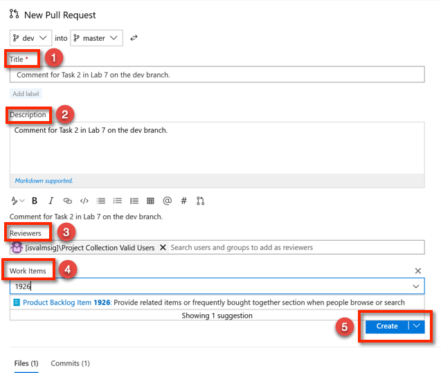
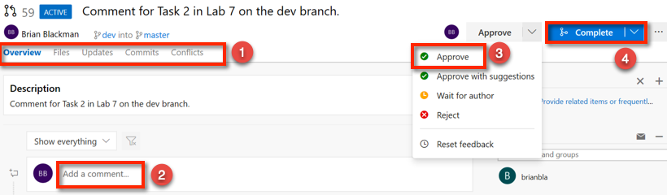
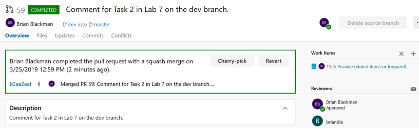

# Lab for Module 7 Developing and Collaborating in the Command Line.
# Using the Command Line to Branch, Edit and Commit​, Fetch/Pull/Push​, and Pull Requests​.
Hands on Lab

## Conditions and Terms of Use Microsoft Confidential - For Internal Use Only

This training package is proprietary and confidential, and is intended only for uses described in the training materials. Content and software is provided to you under a Non-Disclosure Agreement and cannot be distributed. Copying or disclosing all or any portion of the content and/or software included in such packages is strictly prohibited.

The contents of this package are for informational and training purposes only and are provided "as is" without warranty of any kind, whether express or implied, including but not limited to the implied warranties of merchantability, fitness for a particular purpose, and non-infringement.

Training package content, including URLs and other Internet Web site references, is subject to change without notice. Because Microsoft must respond to changing market conditions, the content should not be interpreted to be a commitment on the part of Microsoft, and Microsoft cannot guarantee the accuracy of any information presented after the date of publication. Unless otherwise noted, the companies, organizations, products, domain names, e-mail addresses, logos, people, places, and events depicted herein are fictitious, and no association with any real company, organization, product, domain name, e-mail address, logo, person, place, or event is intended or should be inferred.

**Copyright and Trademarks**

Microsoft may have patents, patent applications, trademarks, copyrights, or other intellectual property rights covering subject matter in this document. Except as expressly provided in written license agreement from Microsoft, the furnishing of this document does not give you any license to these patents, trademarks, copyrights, or other intellectual property.

Complying with all applicable copyright laws is the responsibility of the user. Without limiting the rights under copyright, no part of this document may be reproduced, stored in or introduced into a retrieval system, or transmitted in any form or by any means (electronic, mechanical, photocopying, recording, or otherwise), or for any purpose, without the express written permission of Microsoft Corporation.

For more information, see Use of Microsoft Copyrighted Content at _[htt](http://www.microsoft.com/about/legal/permissions/)[p](http://www.microsoft.com/about/legal/permissions/)_[://www.microsoft.com/about/legal/permissions/](http://www.microsoft.com/about/legal/permissions/)

Microsoft®, Internet Explorer®, and Windows® are either registered trademarks or trademarks of Microsoft Corporation in the United States and/or other countries. Other Microsoft products mentioned herein may be either registered trademarks or trademarks of Microsoft Corporation in the United States and/or other countries. All other trademarks are property of their respective owners.

© 2019 Microsoft Corporation.  All rights reserved.

#Overview
In this lab you will continue with the repositories you created in the previous labs. But, now you will do this all in the Visual Studio IDE. The common pattern is 

**Prerequisites**
1. Module 5 Branching and Merging
1. You have created an AzureDevOps organization.

##  Exercise 1: Managing Branches using the Command Line
You can manage the work in your local and remote Git repositories using the Command Line. Git keeps track of which branch you are working on and makes sure that when you checkout a branch your files match the most recent commit on the branch. Branches let you work with multiple versions of the source code in the same local Git repository at the same time and share those branches with your team.

### Task 1: Creating a new branch in your local repository
1. Open a shell such as Cmd or Terminal.
1. Change directory to your local repository for PartsUnlimited. **This lab assumes you completed earlier labs**.
1. Run **git status** to verify that you are on the master branch and see the following output:

>On branch master

>Your branch is up to date with 'origin/master'.

>nothing to commit, working tree clean 

1. Run **git checkout -b feature/1926** to create a new branch.
1. Run **git branch** and you should see:

>*feature/1926  
>master

### Task 2: Make changes in the new branch and commit them.
1. Edit edit readme.txt and add a new line such as **Hello again from the feature/1926!**. Use a text editor or this at the prompt **echo "Hello from the from feature/1926 branch!" >> readme.txt**
1. Run **git commit -am"Add new line from feature/1926 branch"** to commit your changes.

### Task 3: Share your changes and branch with your team.
1. Run **git push origin feature/196** to share your branch with your team. *Origin is needed if the remote is not configured for the current branch.*

2. View your branch on Azure Repos by switching to the **Branches** tab in the Azure DevOps portal.
 
 

3. Click on **All** to see the newly pushed branch in the Branch view.

## Exercise 2: Creating a Pull Request for pushed branch.
You can create a pull request in Azure Repos. In the previous exercise you pushed your local feature/1926 branch to Azure Repos. 

### Task 1: Create Pull Request for pushed branch in Azure Repos
1. Hover over the Repos hub and then click on **Pull Request**. From the **Pull Requests** view you can view pull requests opened by you, assigned to you, and you can **create new** pull requests.

 

1. Click on **New Pull Request** to create the new pull request. It should be created for the last changes you pushed.

1. With the New Pull Request, by default your commit message it used for the title of the Pull Request. You should give a clear **(1)title** for the pull request that describes the changes in the branch. In the **(2)description** field give a clear explanation of how the changes are implemented along with any resources that might help reviewers understand the changes. You can include Azure DevOps **(3)work items** and hyperlinks to allow others to have as much context as possible when reviewing your changes. Add any **(4)team member or group** who you would like to review the changes, add yourself as a reviewer for the purposes of the lab. Click on **(5)Create** to create the new pull request.

 

1. Reviewers can view the **(1)Files, Updates, Commits, and any Conflicts**. They can **(2)add comments**. Once you get the team's feedback, you can keep the pull request open to continue the conversation or abandon the pull request until your code is ready to be shared again. 

1. Approve your pull request by clicking on **(3) Approve** and complete your pull request after the reviewers approve of the changes by selecting **(4)Complete**.

 

1. Now you have a few options, complete linked work items after merging to complete any linked work items, delete your branch after merging, squash changes when merging your pull request. Click on **Complete Merge**.

 

1. And your pull request, merge, squash, and work items are complete.
 

### Task 2: View History.
1. In the Azure DevOps portal, click on **(1)Repos**, **(2)Files**, then click on the file **(3)readme.txt**, and finally click on **(4)History** to view the history of your **readme.txt** file.
 

### Task 3: Update your local branch with the remote master branch that has the changes from the pull request.
Now that changes were merge with you need to get the pull request changes merged into the remote master updated in your local master. 

1. At the command line run the command **git checkout master** to ensure you are on the master branch.
1. Run **git fetch** to see the change from the remote master.
1. Run **git pull** to update your master with the change.

## Congratulations, you have created a branch, switched branches, shared your branch with your team, created and completed a pull request, and updated your local master with the changes from the pull request!