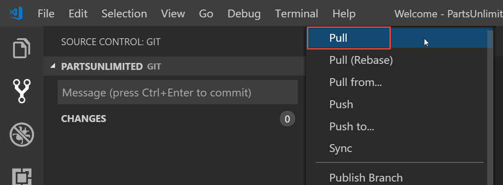

# Lab for Module 7 Developing and Collaborting in Visual Studio Code
# Using Visual Studio Code to Branch, Edit and Commit​, Fetch/Pull/Push​ and create Pull Requests​​
Hands on Lab

## Conditions and Terms of Use Microsoft Confidential - For Internal Use Only

This training package is proprietary and confidential, and is intended only for uses described in the training materials. Content and software is provided to you under a Non-Disclosure Agreement and cannot be distributed. Copying or disclosing all or any portion of the content and/or software included in such packages is strictly prohibited.

The contents of this package are for informational and training purposes only and are provided "as is" without warranty of any kind, whether express or implied, including but not limited to the implied warranties of merchantability, fitness for a particular purpose, and non-infringement.

Training package content, including URLs and other Internet Web site references, is subject to change without notice. Because Microsoft must respond to changing market conditions, the content should not be interpreted to be a commitment on the part of Microsoft, and Microsoft cannot guarantee the accuracy of any information presented after the date of publication. Unless otherwise noted, the companies, organizations, products, domain names, e-mail addresses, logos, people, places, and events depicted herein are fictitious, and no association with any real company, organization, product, domain name, e-mail address, logo, person, place, or event is intended or should be inferred.

**Copyright and Trademarks**

Microsoft may have patents, patent applications, trademarks, copyrights, or other intellectual property rights covering subject matter in this document. Except as expressly provided in written license agreement from Microsoft, the furnishing of this document does not give you any license to these patents, trademarks, copyrights, or other intellectual property.

Complying with all applicable copyright laws is the responsibility of the user. Without limiting the rights under copyright, no part of this document may be reproduced, stored in or introduced into a retrieval system, or transmitted in any form or by any means (electronic, mechanical, photocopying, recording, or otherwise), or for any purpose, without the express written permission of Microsoft Corporation.

For more information, see Use of Microsoft Copyrighted Content at _[htt](http://www.microsoft.com/about/legal/permissions/)[p](http://www.microsoft.com/about/legal/permissions/)_[://www.microsoft.com/about/legal/permissions/](http://www.microsoft.com/about/legal/permissions/)

Microsoft®, Internet Explorer®, and Windows® are either registered trademarks or trademarks of Microsoft Corporation in the United States and/or other countries. Other Microsoft products mentioned herein may be either registered trademarks or trademarks of Microsoft Corporation in the United States and/or other countries. All other trademarks are property of their respective owners.

© 2019 Microsoft Corporation.  All rights reserved.

#Overview
In this lab you will continue with the repositories you created in the previous labs. But, now you will do this all in the Visual Studio IDE.

**Prerequisites**
 1. Module 5 Branching and Merging
 1. Install the Azure Repos Extension

##  Exercise 1: Managing Branches in Visual Studio

You can manage the work in your local and remote Git repo from the **Branches** title/view in Team Explorer.

### Task 1: Creating a new branch in your local repository

1.	From the **Command Palette** type **git create branch** and click on it

 

2.	Type  **feature** as the branch name press 'Enter'.

 

3.	Select  **“master”** as the ref to branch from.

 

4.	Note that you can always see what branch you’re working on in the bottom left corner of Visual Studio Code. You can also easily switch between branches and create new ones.

 

### Task 2: Checking out and publishing branches

Git keeps track of which branch you are working on and makes sure that when you checkout a branch your files match the most recent commit on the branch. Branches let you work with multiple versions of the source code in the same local Git repository at the same time.

1.	From the branch area of **Status Bar**, click on the **branches** select the just created **feature** branch to check it out.

 

2.	From the **source control area** select **Publish Branch**. This will share it with the server

 
 

4.	On Azure DevOps, switch to the **Branches** tab.
 
 

5.	You should see the newly pushed **feature** branch

 

6.	Back in **Visual Studio Code**, Click on the **branches icon** in the status bar. Here you can see all of the remote branches, including those that haven’t been pulled down locally.

 

## Exercise 2: Creating a Pull Request.
You can create a pull request from Visual Studio Code or in Azure Repos. In this exercise you will use Visual Studio Code. In the previous exercise you pushed your local **feature** branch to Azure Repos. 

### Task 1: Install the Azure Repos Extension
1. Download and install from the Marketplace 
 

### Task 2: Create Pull Request for pushed **feature** branch in Visual Studio Code
1. You can view your request from Visual Studio Code. Click on the Pull Request Icon in the status bar in order to bring up a list of pull requests assigned to you.

 

2. To create a new Pull Request go the command palette and type **team pull**.  Click on **Create Pull Request** to open up your web browser where you can create the new pull request in the Azure DevOps Services web portal for your current branch.

 

### Task 3: Creating Pull Request for pushed branch
1. With the New Pull Request, by default your commit message it used for the title of the Pull Request. You should give a clear **(1)title** for the pull request that describes the changes in the branch. In the **(2)description** field give a clear explanation of how the changes are implemented along with any resources that might help reviewers understand the changes. You can include Azure DevOps **(3)work items** and hyperlinks to allow others to have as much context as possible when reviewing your changes. Add any **(4)team member or group** who you would like to review the changes, add yourself as a reviewer for the purposes of the lab. Click on **(5)Create** to create the new pull request.

 

2. Reviewers can view the **(1)Files, Updates, Commits, and any Conflicts**. They can **(2)add comments**. Once you get the team's feedback, you can keep the pull request open to continue the conversation or abandon the pull request until your code is ready to be shared again. 

3. Approve your pull request by clicking on **(3) Approve** and complete your pull request after the reviewers approve of the changes by selecting **(4)Complete**.

 

4. Now you have a few options, complete linked work items after merging to complete any linked work items, delete your after merging, squash changes when merging your pull request. Click on **Complete Merge**.

 

5. And your pull request, merge, squash, and work items are complete.
 

### Task 4: Update your local branch with the remote master branch that has the changes from the pull request.
Now you need to get the pull request changes merged into the remote master updated in your local master. 

1. In Visual Studio Code, click on the **Branches Icon**  in the status bar (it should be on the feature branch, and then select the **master** branch.

 

2. Now we will pull the changes from the Azure repo to your local repo.  First click on the **source control** icon then click on the **..." next to the repo you are working on.

 

2. Next select **pull** from the list.  The Visual Studio Code with initiation pulling the changes into your local repo.  Once is has completed the merged code will be on your computer.

 

## Exercise 3: Deleting branches

### Task 1: Deleting branches locally and remotely

1.	When you created the **feature** branch earlier, **Visual Studio Code** switched you to it. Since you are not working on feature and no longer need it lets delete it.  Manually switch back to by clicking the **branches icon** and then clicking on **master**

 

Then go to the Command Palette and select  **Git Delete Branch**

 

Then select the branch **feature** and it will be deleted

 

2.	Note that while you have deleted the local **dev** branch, the remote branch still exists

 

3.	To delete the remote branch, go the the terminal window and enter  **git push origin --delete feature** and press enter.

 

4.	You can confirm that it’s gone by refreshing the **Branches** page on Azure DevOps.

 

## Congratulations, you have created a branch, switched branches, shared your branch with your team, deleted local and remote branches, and you managed branches from Visual Studio Code!