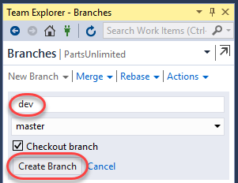
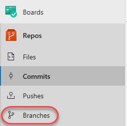
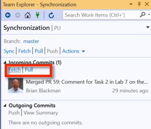

# Lab for Module 7 Developing and Collaborating in Visual Studio
# Using Visual Studio to Branch, Edit and Commit​, Fetch/Pull/Push​, and Pull Requests​
Hands on Lab

## Conditions and Terms of Use Microsoft Confidential - For Internal Use Only

This training package is proprietary and confidential, and is intended only for uses described in the training materials. Content and software is provided to you under a Non-Disclosure Agreement and cannot be distributed. Copying or disclosing all or any portion of the content and/or software included in such packages is strictly prohibited.

The contents of this package are for informational and training purposes only and are provided "as is" without warranty of any kind, whether express or implied, including but not limited to the implied warranties of merchantability, fitness for a particular purpose, and non-infringement.

Training package content, including URLs and other Internet Web site references, is subject to change without notice. Because Microsoft must respond to changing market conditions, the content should not be interpreted to be a commitment on the part of Microsoft, and Microsoft cannot guarantee the accuracy of any information presented after the date of publication. Unless otherwise noted, the companies, organizations, products, domain names, e-mail addresses, logos, people, places, and events depicted herein are fictitious, and no association with any real company, organization, product, domain name, e-mail address, logo, person, place, or event is intended or should be inferred.

**Copyright and Trademarks**

Microsoft may have patents, patent applications, trademarks, copyrights, or other intellectual property rights covering subject matter in this document. Except as expressly provided in written license agreement from Microsoft, the furnishing of this document does not give you any license to these patents, trademarks, copyrights, or other intellectual property.

Complying with all applicable copyright laws is the responsibility of the user. Without limiting the rights under copyright, no part of this document may be reproduced, stored in or introduced into a retrieval system, or transmitted in any form or by any means (electronic, mechanical, photocopying, recording, or otherwise), or for any purpose, without the express written permission of Microsoft Corporation.

For more information, see Use of Microsoft Copyrighted Content at _[htt](http://www.microsoft.com/about/legal/permissions/)[p](http://www.microsoft.com/about/legal/permissions/)_[://www.microsoft.com/about/legal/permissions/](http://www.microsoft.com/about/legal/permissions/)

Microsoft®, Internet Explorer®, and Windows® are either registered trademarks or trademarks of Microsoft Corporation in the United States and/or other countries. Other Microsoft products mentioned herein may be either registered trademarks or trademarks of Microsoft Corporation in the United States and/or other countries. All other trademarks are property of their respective owners.

© 2019 Microsoft Corporation.  All rights reserved.

#Overview
In this lab you will continue with the repositories you created in the previous labs. But, now you will do this all in the Visual Studio IDE. The common pattern is 

**Prerequisites**
1. Module 5 Branching and Merging
2. Visual Studio 2017/2019
**3. You have Visual Studio connected to your AzureDevOps project and you have the ProjectsUnlimited.sln open from your local repository.**

##  Exercise 1: Managing Branches in Visual Studio
You can manage the work in your local and remote Git repositories from the **Branches** view in Team Explorer. Git keeps track of which branch you are working on and makes sure that when you checkout a branch your files match the most recent commit on the branch. Branches let you work with multiple versions of the source code in the same local Git repository at the same time and share those branches with your team.

### Task 1: Creating a new branch in your local repository using Visual Studio.
1. From the **Team Explorer** dropdown, select **Branches**

 

2. There is only one local branch at this time, which is **master**. Right-click it and select **New Local Branch From** to create a new one.

 

3. For the purpose of a lab, name the new branch **“dev”** and click **Create Branch**. Usually, your team will come up with a convention such as features/yourname or alias. Other patterns are /features/workitemid or users/username or alias. Try to come up with a pattern and remain consistent. If you choose a different name for the branch remember it so you can replace it whenever we reference the **dev** branch.

 

4. Note that you can always see what branch you’re working on in the bottom right corner of Visual Studio in the status bar. You can also easily switch between branches, create new ones, and manage them all from the status bar.

 

### Task 2: Checking out and publishing branches
1. In **Team Explorer** click on the branches icon from the status bar and select the **dev** branch to switch to it if you are not already working on the **dev** branch.

 

2. Make sure you have the PartsUnlimited solution open. Under the PartsUnlimited.sln PartsUnlimitedWebsite/Controllers folder open **CheckoutController.cs**.

 

4. Make a comment **//** somewhere in the file as shown.

 

5. Save the file and commit your changes with a message from the Changes view.

 

Your changes are committed locally.

2. Switch to the Branches view, right-click the **dev** branch and select **Push Branch**. This will share the branch with your team.

 
 

3. It may take a moment for the branch push to succeed
 
 

4. On Azure DevOps, switch to the **Branches** tab.
 
 

5. You should see the newly pushed **dev** branch

 

6. Back in **Visual Studio**, in the Branches view expand **remotes/origin**. Here you can see all of the remote branches, including those that haven’t been pulled down locally.

 

## Exercise 2: Creating a Pull Request.
You can create a pull request from Visual Studio or in Azure Repos. In this exercise you will use Visual Studio. In the previous exercise you pushed your local **dev** branch to Azure Repos. 

### Task 1: Create Pull Request for pushed **dev** branch in Visual Studio
1. You can initiate a pull request from Visual Studio. From the **Pull Requests* view you can view pull requests opened by you, assigned to you, and you can create new pull requests.

 

2. Select New Pull Request to open up your web browser where you can create the new pull request in the Azure DevOps Services web portal for your current branch.

 

### Task 3: Creating Pull Request for pushed branch
1. With the New Pull Request, by default your commit message it used for the title of the Pull Request. You should give a clear **(1)title** for the pull request that describes the changes in the branch. In the **(2)description** field give a clear explanation of how the changes are implemented along with any resources that might help reviewers understand the changes. You can include Azure DevOps **(3)work items** and hyperlinks to allow others to have as much context as possible when reviewing your changes. Add any **(4)team member or group** who you would like to review the changes, add yourself as a reviewer for the purposes of the lab. Click on **(5)Create** to create the new pull request.

 

2. Reviewers can view the **(1)Files, Updates, Commits, and any Conflicts**. They can **(2)add comments**. Once you get the team's feedback, you can keep the pull request open to continue the conversation or abandon the pull request until your code is ready to be shared again. 

3. Approve your pull request by clicking on **(3) Approve** and complete your pull request after the reviewers approve of the changes by selecting **(4)Complete**.

 

4. Now you have a few options, complete linked work items after merging to complete any linked work items, delete your branch after merging, squash changes when merging your pull request. Click on **Complete Merge**.

 

5. And your pull request, merge, squash, and work items are complete.
 

### Task 4: Update your local branch with the remote master branch that has the changes from the pull request.
Now you need to get the pull request changes merged into the remote master updated in your local master. 

1. In Visual Studio, from the **Team Explorer** dropdown, select **Branches**.

 

2. Double click **master** to switch back to the local **master** branch, or select master from the status bar.

 

3. In Team Explorer click on the **Sync View**.

 

4. Click on **Fetch** to see the changes that will be merged into your local master. Click on **Pull** to merge the change into your local master.

 

## Exercise 3: Deleting branches
### Task 1: Deleting branches locally and remotely
1. In Visual Studio, if you are not on the master branch then checkout master.
2. Since you are not working on dev and no longer need it, right-click it and select **Delete**

 

2. Note that while you have deleted the local **dev** branch, the remote branch still exists

 

3. To delete the remote branch, right-click it under **remotes/origin** and select **Delete Branch From Remote**.

 

4. The remote branch should delete pretty quickly.

 

5. You can confirm that it’s gone by refreshing the **Branches** page on Azure DevOps.

 

## Congratulations, you have created a branch, switched branches, shared your branch with your team, deleted local and remote branches, created and managed a pull request, and you managed branches from Visual Studio IDE!