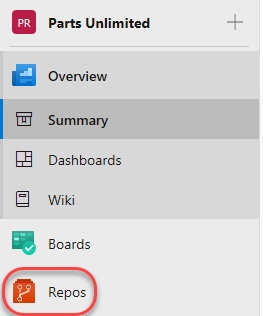

# Instructions for WokshopPlus Azure DevOps Essentials - Git Lab Setup Instructions

# Overview
WokshopPlus Azure DevOps Essentials - Git labs require a preconfigured Parts Unlimited team project. This document outlines the required steps to set up the required Team Project data.

## Task 1: Configuring the Parts Unlimited team project

1. Navigate to https://azuredevopsdemogenerator.azurewebsites.net. This utility site will automate the process of creating a new Azure DevOps project within your account that is prepopulated with content (work items, repos, etc.) required for the lab. For more information on the site, please see https://docs.microsoft.com/en-us/azure/devops/demo-gen.

2. Sign in using the Microsoft account associated with your Azure DevOps subscription.

**Accept** the permission requests for accessing your subscription.

4. Select your Azure DevOps organization and enter the project name **“Parts Unlimited”**. Click **Choose Template**.

5. Select the **PartsUnlimited** template and click **Select Template**.

6. Click **Create Project** and wait for the process to complete.

 
## Task 2: Configuring the Parts Unlimited solution in Visual Studio, Visual Studio Code, or using the Command Line.

1. Some labs will require you to open the **Parts Unlimited** solution in **Visual Studio**, **Visual Studio Code**, or using the **Command Line**. 

2. Navigate to your Azure DevOps team project for **Parts Unlimited**. It will be something like https://dev.azure.com/YOURACCOUNT/Parts%20Unlimited.

3. Navigate to the **Repos hub**.

4. Click (1)**Clone**.
5. Select (2)**Copy Url** for command line.
6. Or select (3)**IDE Clone in** such as Visual Studio or Visual Studio Code depending on which IDE is used for your Workshop.

7. Follow the workflow to clone and configure the project in your IDE or save the Copied URL for clone to be used in your initial Labs.
8. For Visual Studio. Click **Clone in Visual Studio** to copy the repository locally. You will be prompted with a dialog like the following.

For Visual Studio Code, Click **Clone in VS Code** to copy the repository locally. You will be prompted with a dialog like the following and click on **Open**.

At this point you have cloned the repo locally except if you are using the command line.
